# Ubiquiti UniFi Multi-WAN Load Balancing & VLAN Segmentation Lab

A home/office lab network built entirely on **Ubiquiti UniFi** hardware and the UniFi Network application, demonstrating dual-WAN load balancing, VLAN-based network segmentation, inter-VLAN firewall isolation, guest captive portal authentication, and per-network wireless policy control.

## Overview

This project simulates a small business network with three distinct departments (IT, Finance, Guest) sharing a single Ubiquiti UniFi gateway, each isolated at Layer 3 with independent wireless SSIDs, bandwidth policies, and firewall rules — while the WAN edge load-balances traffic across two internet circuits for redundancy and throughput. The Guest network additionally sits behind a UniFi-hosted captive portal.

## Hardware / Platform (Ubiquiti UniFi)

- **Gateway:** Ubiquiti UniFi UXG Fiber
- **Switch:** Ubiquiti UniFi USW Pro Max 16 PoE
- **Access Points:** 3x Ubiquiti UniFi U6 Pro (Guest, Finance, IT), meshed via U6 Mesh units
- **Controller:** Ubiquiti UniFi Cloud Key ("UniFi Lab" UCK G2 Plus), running the UniFi Network application
- **WAN circuits:** 2x Afrihost ("Afrihost Other") fiber links
- **Software:** UniFi Network application (Network 10.x), UniFi OS 5.1.x

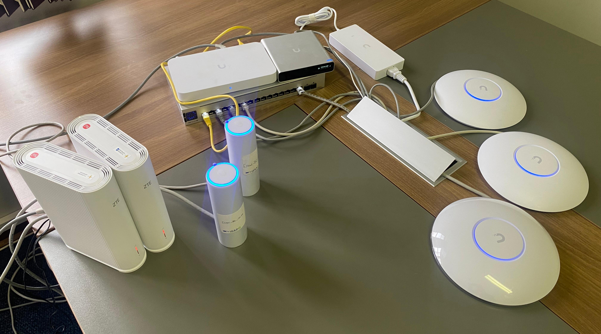

## Network Topology

```
AFRIHOST (WAN1) ─┐
AFRIHOST (WAN2) ─┼──> UXG Fiber (Gateway) ──> USW Pro Max 16 PoE
                 │                                   │
                 │              ┌────────────────────┼────────────────────┐
                 │              │                     │                    │
                 │        Guest U6 Pro          Finance U6 Pro         IT U6 Pro
                 │              │                     │                    │
                 │          U6 Mesh          Athenkosi (wired PC)      U6 Mesh
```

See full controller-generated topology diagrams:
- [screenshots/network-topology-simple.png](screenshots/network-topology-simple.png)
- [screenshots/network-topology-full.png](screenshots/network-topology-full.png)
- [screenshots/wan-stp-diagram.png](screenshots/wan-stp-diagram.png) — STP root and per-link WAN health

## Initial Deployment

Devices were provisioned from a factory/unadopted state through the local controller before being assigned to their final networks.

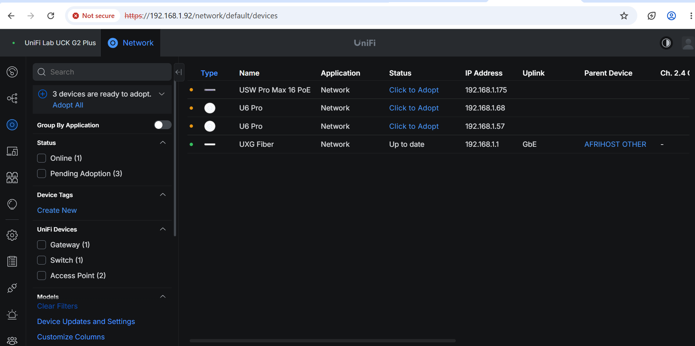
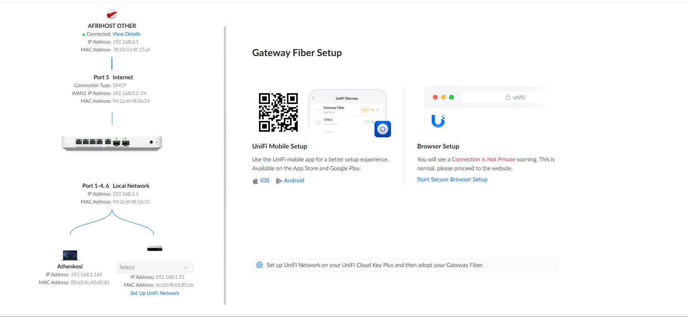
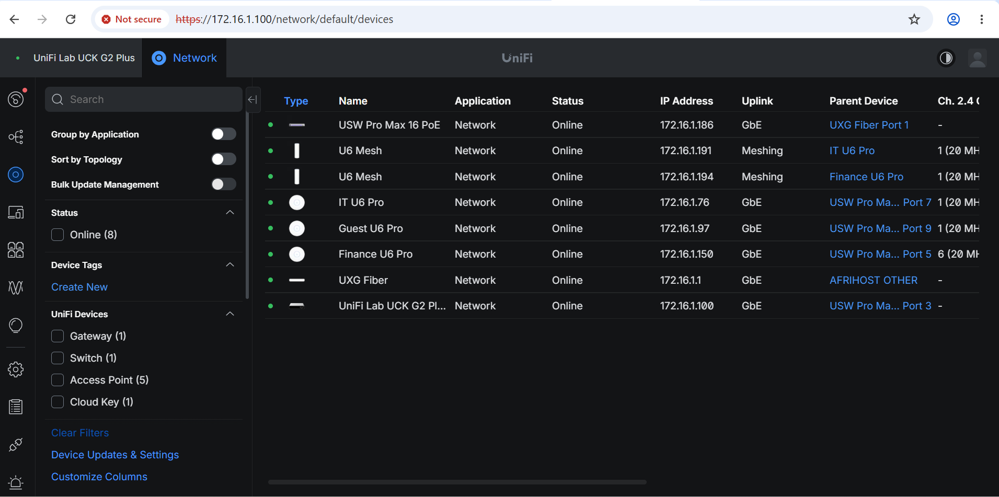

## VLAN Design

| Network | VLAN ID | Subnet          | Broadcasting AP  | SSID         |
|---------|---------|-----------------|------------------|--------------|
| Default | 1       | 172.16.1.0/24   | —                | —            |
| IT      | 10      | 172.16.10.0/24  | IT U6 Pro        | IT-WiFi      |
| Finance | 20      | 172.16.20.0/24  | Finance U6 Pro   | Finance-WiFi |
| Guest   | 30      | 172.16.30.0/24  | Guest U6 Pro     | Guest-WiFi   |

All networks are routed through the UXG Fiber gateway with DHCP served locally.

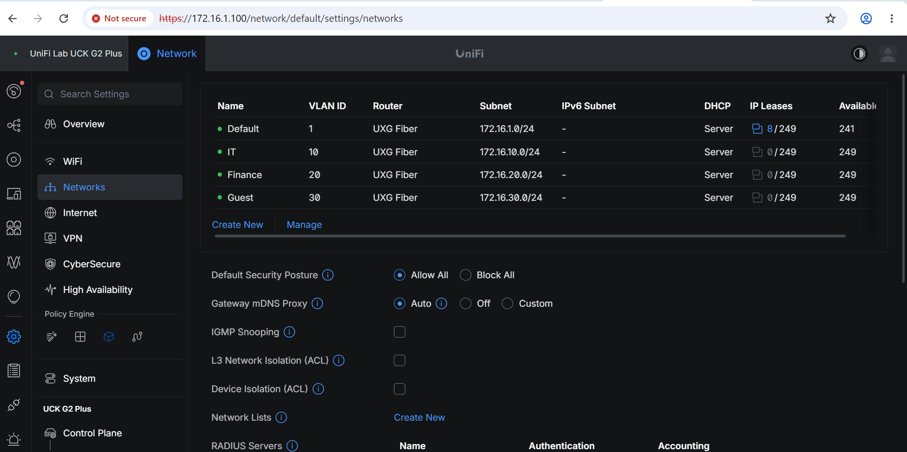

## WAN / Load Balancing

- **Mode:** Load Balancing (not failover-only) across WAN1 and WAN3
- **Distribution:** ~34% / ~33% / ~33% split across load-balanced WAN members
- **Health check:** WAN SLA monitor via ICMP ping to `1.1.1.1`
- **Observed uptime:** 98–99%+ per link over the monitoring window

This provides both aggregate throughput and automatic degradation handling if one circuit drops.

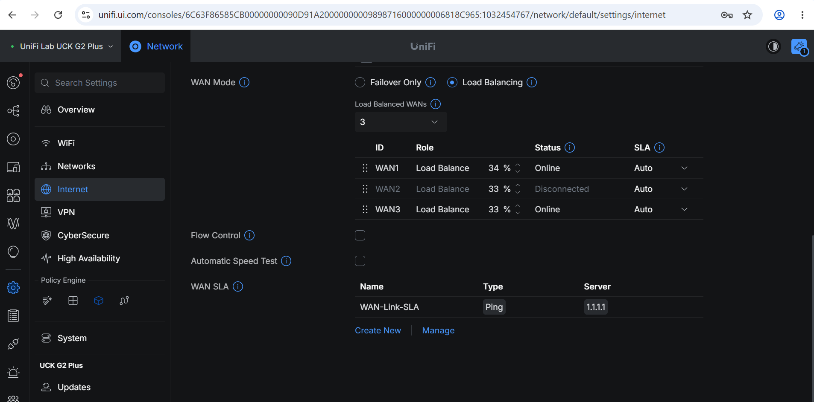
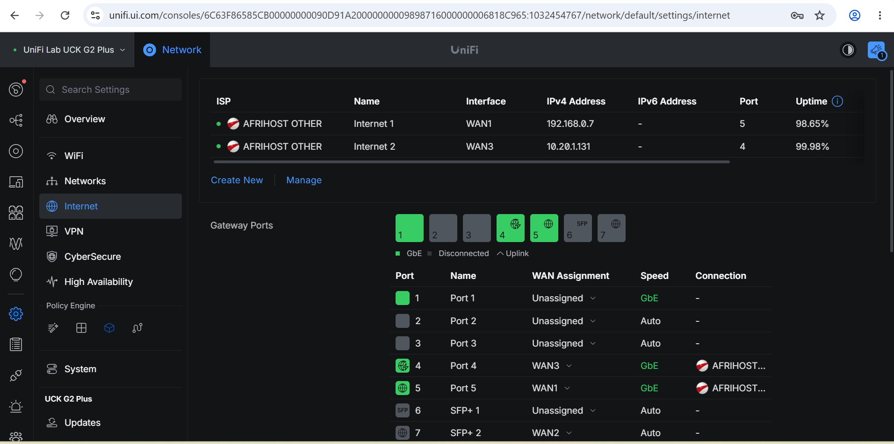
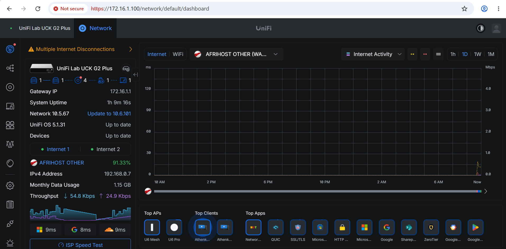

## Firewall Rules (Inter-VLAN Isolation)

| Rule Name           | Action | Source     | Destination      | Schedule |
|----------------------|--------|-----------|-------------------|----------|
| Block Finance_to_IT | Block  | Finance    | IT                | Always   |
| Block IT_to_Finance | Block  | IT         | Finance           | Always   |
| LAN_to_WAN          | Allow  | 3 Networks | Any (Internet)    | Always   |

Finance and IT VLANs are fully isolated from each other at Layer 3 while both retain outbound internet access — a common segmentation pattern for separating sensitive departmental traffic (e.g., finance systems) from general IT/end-user traffic.

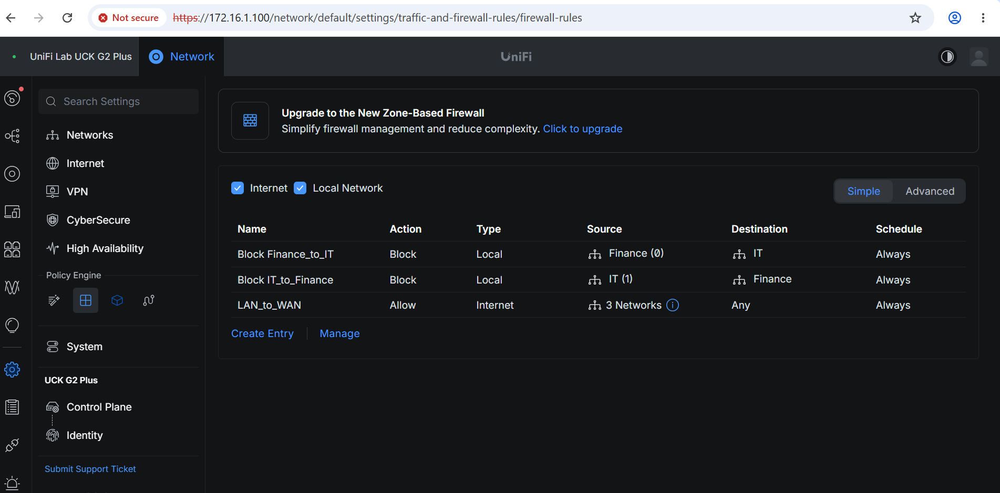

## Wireless Policy

Per-SSID bandwidth shaping is applied to enforce fair usage and prioritize business-critical traffic:

| SSID          | Download   | Upload    |
|---------------|-----------|-----------|
| Default       | Unlimited | Unlimited |
| Guest-WiFi    | 10 Mbps   | 5 Mbps    |
| Finance-WiFi  | 50 Mbps   | 50 Mbps   |
| IT-WiFi       | 100 Mbps  | 100 Mbps  |

Additional WiFi hardening includes wireless meshing for AP backhaul redundancy, UniFi Auto-Link, and WiFiman support enabled fleet-wide, with WPA2 security on all three SSIDs.

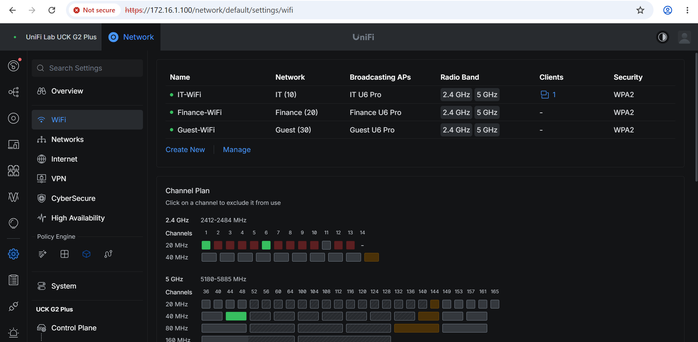
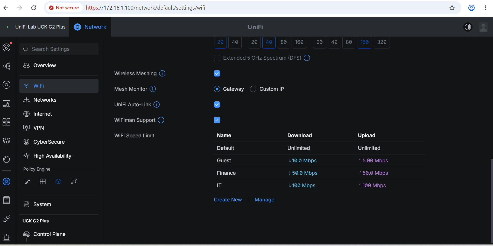

## Guest Captive Portal

The Guest-WiFi SSID is served through UniFi's built-in guest hotspot portal ("UniFi Lab" branded splash page) before granting internet access, keeping guest traffic auditable and separate from authenticated staff networks.

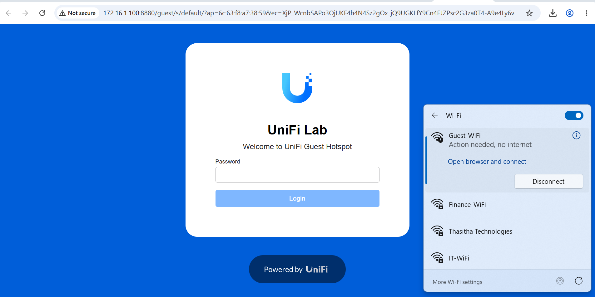

## Key Skills Demonstrated

- Dual-WAN configuration and load-balanced failover on a Ubiquiti UniFi gateway
- VLAN design and subnetting for departmental network segmentation
- Zone-based firewall rule creation for inter-VLAN traffic control
- SSID-to-VLAN mapping with per-network wireless bandwidth policy
- Guest network isolation with UniFi captive portal / guest hotspot authentication
- Mesh AP deployment for wireless backhaul redundancy
- Ubiquiti UniFi device adoption and controller management (Cloud Key / UniFi Network application)

## Repo Structure

```
Multi-WAN-VLAN-Segmentation-Lab/
├── README.md
└── screenshots/
    ├── hardware-setup.jpeg
    ├── network-topology-simple.png
    ├── network-topology-full.png
    ├── wan-stp-diagram.png
    ├── device-adoption.png
    ├── gateway-fiber-setup.png
    ├── device-list.png
    ├── vlan-networks.png
    ├── wan-load-balancing-config.png
    ├── wan-ports-config.png
    ├── dashboard-internet-status.png
    ├── firewall-rules.png
    ├── wifi-networks-channel-plan.png
    ├── wifi-speed-limits.png
    └── guest-captive-portal.png
```

## Notes

This is a lab/demo environment (private IP ranges, internal controller access) built entirely on Ubiquiti's UniFi ecosystem to showcase enterprise-style network segmentation practices on prosumer-grade UniFi hardware.
